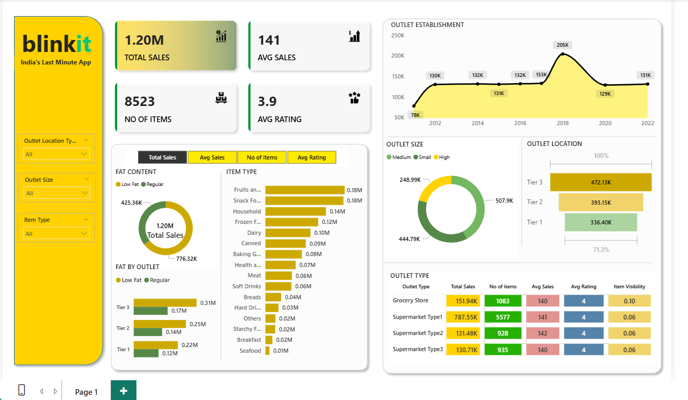

# 🛒 Blinkit Sales Analysis Dashboard | Power BI

📊 Business-Focused Dashboard for Sales Performance & Revenue Optimization  

📌 End-to-End Project: Data Cleaning (Python) → Data Modeling → Power BI Dashboard → Business Insights  

⭐ Highlight: Identified Tier 3 outlets and Supermarket Type 1 as top revenue drivers

---

## 🚀 Project Overview

This project analyzes **Blinkit grocery sales data** to uncover key business insights related to **product performance, outlet efficiency, and customer behavior**.

📊 Dataset Size: 8,500+ items | 1.20M+ total sales  

👉 The dashboard enables stakeholders to **track KPIs, identify revenue drivers, and optimize business strategy**.

---

## 🎯 Business Problem

Blinkit operates across multiple outlet types and product categories, but lacks clear visibility into:

- Which products drive the most revenue  
- Which outlet types and locations perform best  
- How customer preferences impact sales  
- How to optimize inventory and store performance  

👉 Key Question:  
**How can Blinkit maximize revenue and improve outlet performance?**

---

## 🛠 Tools & Technologies

- Python (Pandas, NumPy) – Data Cleaning  
- Power BI – Dashboard Development  
- DAX – KPI Calculations  
- Data Modeling  

---

## 📊 Dataset

The dataset includes:

- Item Type  
- Outlet Type  
- Outlet Size  
- Outlet Location (Tier 1, 2, 3)  
- Item Visibility  
- Ratings  
- Sales  

---

## 🔄 Data Processing Workflow

1. Cleaned and transformed raw data using **Python (Pandas & NumPy)**  
2. Handled missing values and inconsistencies  
3. Loaded cleaned dataset into **Power BI**  
4. Built data model and relationships  
5. Created KPIs using **DAX**  
6. Designed interactive dashboard  

---

## 📈 Dashboard Features

### ✔ Key KPIs
- Total Sales: **1.20M+**  
- Average Sales: **141**  
- Total Items: **8,523**  
- Average Rating: **3.9**  

---

### ✔ Product Analysis
- Identified top-performing categories:
  - Fruits & Vegetables  
  - Snack Foods  
  - Household Items  

👉 These categories drive the majority of revenue  

---

### ✔ Outlet Performance
- Tier 3 outlets generate highest sales  
- Supermarket Type 1 contributes maximum revenue  
- Medium-sized outlets dominate performance  

---

### ✔ Customer Behavior Insights
- Customer ratings consistently around **3.9–4.0**  
- Strong demand for regular and low-fat products  

---

### ✔ Trend Analysis
- Sales trends across outlet establishment years  
- Identifies growth patterns and expansion impact  

---

## 📊 Key Insights

- Tier 3 locations outperform Tier 1 & 2 in total sales  
- Supermarket Type 1 contributes the largest revenue share  
- Top product categories contribute ~60–70% of total sales  
- Medium-sized outlets show optimal performance  
- Stable customer ratings indicate consistent service quality  

---

## 💡 Business Recommendations

- Expand operations in Tier 3 locations  
- Increase inventory for high-performing categories  
- Focus on scaling Supermarket Type 1 outlets  
- Optimize product mix based on customer demand  
- Use ratings data to improve underperforming outlets  

---

## 📷 Dashboard Preview

---

## 🎯 Impact

- Analyzed 1.20M+ sales data to uncover key revenue drivers  
- Built an interactive dashboard for real-time decision-making  
- Identified high-performing products and outlet types  
- Enabled data-driven strategy for business growth  

---

## ⭐ Future Enhancements

- Sales forecasting using time series models  
- Customer segmentation analysis  
- Integration with cloud platforms (AWS / Azure)  

---

## 👨‍💻 Author

**Chandan Kumar Sah**  
Data Analyst | SQL • Power BI • Python • Machine Learning  

---

⭐ If you found this project useful, consider giving it a **star**
